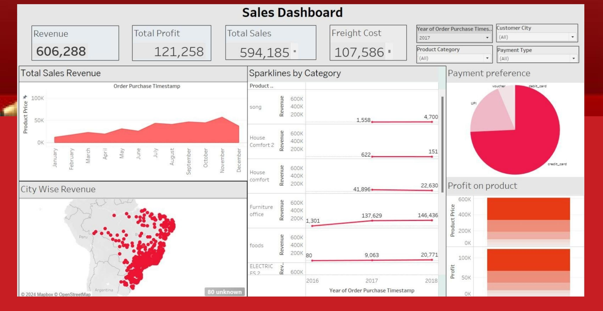
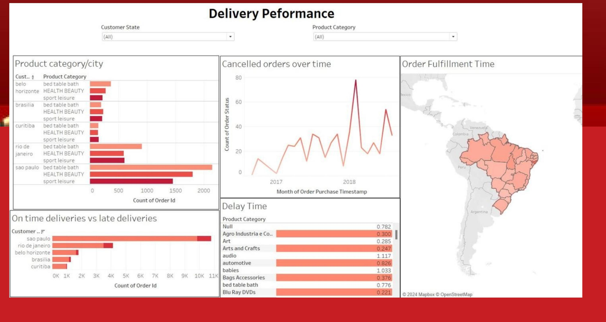
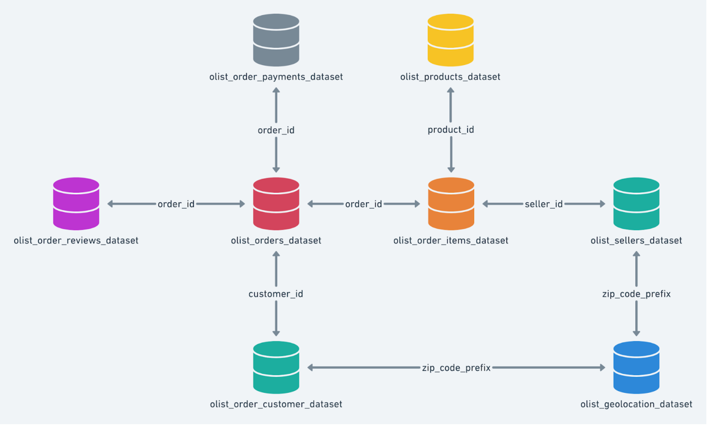

# Target Brazil — E-Commerce Analytics (Tableau)

Two interactive Tableau dashboards analyzing **~100,000 e-commerce orders (2016–2018)**
from the Brazilian Olist dataset, covering revenue/profitability and delivery
performance — built to support decisions in logistics, operations, and revenue
optimization.

---

## Revenue Analysis Dashboard

KPIs (Revenue, Total Profit, Total Sales, Freight Cost) with monthly sales trends,
city-level revenue mapped across Brazil, per-category revenue sparklines, payment-method
preferences, and product profitability — filterable by year, city, category, and payment type.

**Selected insights:** revenue concentrated in major hubs (São Paulo, Rio de Janeiro);
strong categories include Furniture Office and House Comfort; credit card dominates
payment mix. Recommendations focused on optimizing freight in high-revenue cities and
allocating resources to top-performing categories.

## Delivery Performance Dashboard

On-time vs. late deliveries by city, cancelled orders over time, geographic order-fulfillment
times across Brazilian states, and delay times by product category — filterable by state
and category.

**Selected insights:** late deliveries concentrated in high-volume cities (São Paulo);
Automotive among the highest-delay categories; identifiable spikes in cancellations.
Recommendations focused on prioritizing logistics resources in problem cities and
optimizing the supply chain for high-delay categories.

## Data Model

The analysis joins seven Olist tables (orders, payments, order items, products, sellers,
reviews, customers, geolocation) on their shared keys:

---

## What's in this repo

| File | What it is |
|------|------------|
| `images/` | Dashboard screenshots and the data-model diagram |
| `Target_Brazil_Presentation.pptx` / `.pdf` | Full project deck — overview, dataset, schema, insights, and recommendations |

## Tools

Tableau · SQL · public Olist Brazilian E-Commerce dataset (Kaggle)

## Note

Built from a public dataset; no proprietary or personal data. The original Tableau
workbook is not included — these high-resolution dashboard exports and the deck
capture the full analysis.
